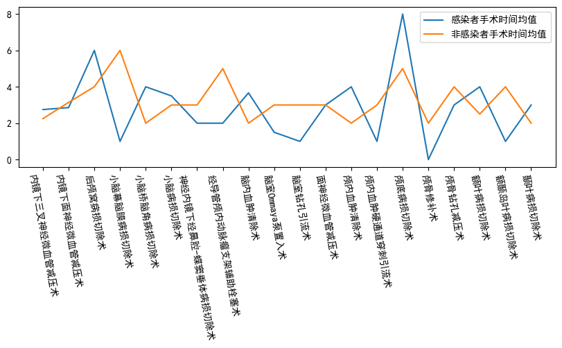
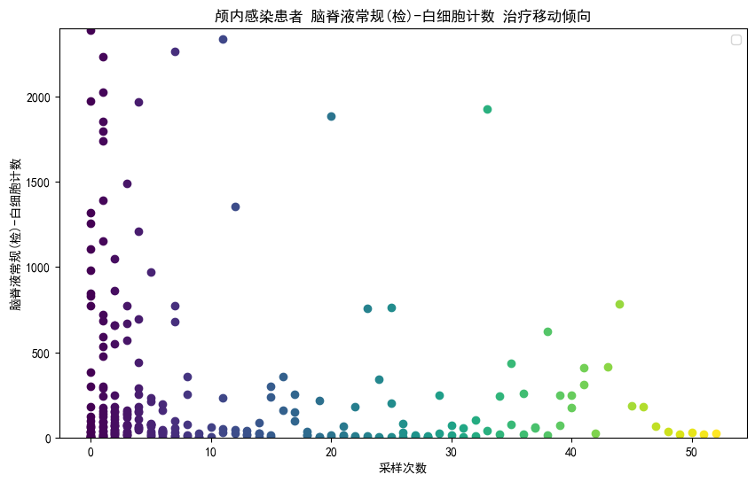
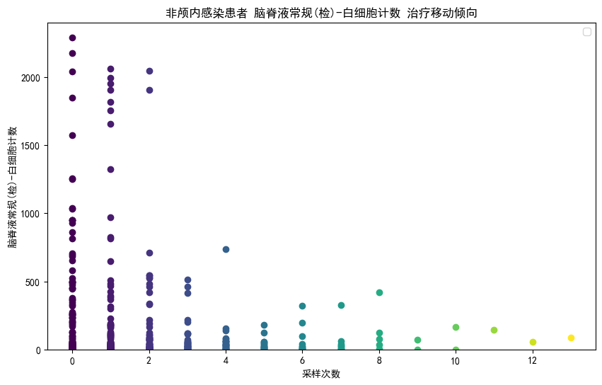

# 一. 分析影响颅内感染的主要因素有哪些？

## 数据集观察

数据集主要可以作以下划分

| 说明：       | 病人唯一标识 | 性别/年龄   | 主要诊断+其他诊断\*n       | (手术方式/麻醉方式)n + 手术持续时间      | 样本编号(采样次数唯一标识) | 量化项目            |
| :----------- | :----------- | :---------- | :------------------------- | :--------------------------------------- | -------------------------- | ------------------- |
| 原数据标识： | mr_bah       | mr_xb/mr_nn | mr_cyzyzdmc+mr_cyqtzdmc{n} | mr_ssmzfs{n}/mr_sscxsj{n} + mr_ssmzfs{k} | item_code                  | result quantitative |

其中“颅内感染”主要包含在诊断中。数据的对应关系是 1 个病人对应 n 个样本编号（n 不固定）。

对于以上的数据集划分，我们很自然地想到了颅内感染的可能影响因素：

1. 其他病症对“颅内感染”的发生有影响
2. 手术方式对“颅内感染”的发生有影响
3. 手术时间对“颅内感染”的发生有影响

## 数据集预处理

取出数据集中的 [病人唯一标识,性别/年龄,主要诊断+其他诊断\*n,(手术方式/麻醉方式)n + 手术持续时间] 并去除重复列，这样我们就能得到由病人唯一标识作为索引的数据集。

## 分析手术对颅内感染的影响

### 分析手术方式对颅内感染的影响

因为数据集“主要诊断”一列并未包含“颅内感染”，因此我们分析手术是为了治疗主要诊断，而颅内感染发生在手术之后。因此颅内感染与手术之间就具有时间的先后顺序，即颅内感染是手术过程中发生的或手术后发生了颅内感染。因此我们一旦确定了手术与颅内感染的相关性，便可以尽可能地说明，手术对颅内感染产生了影响（这与后来分析其他病症对颅内感染的影响不同）

#### 引入独热编码（One-Hot Encoding）

独热编码是针对具有明确分类值的数据进行预处理的有效方法，通过将每个分类值转换为独立的二进制向量，确保模型正确理解非数值分类特征，避免数值关系的误判。

独热编码举例：

    给定一个标签列表[A,D,C,B],我们需要将其转化成0-1编码，即：
    ["A","B","C","D"]
    [1,0,0,0]
    [0,0,0,1]
    [0,0,1,0]
    [0,1,0,0]

由于每个病人所包含的手术方式数量不统一，且为了方便后续的操作，我们先把数据中的手术方式转化成 one_hot_encoding。为接下来实现计算颅内感染与手术方式的相关性分析，我们将手术方式的独热编码矩阵中加入“是否有颅内感染”这一项。我们选择去除掉样本数量过少的标签。这样我们就获得了手术方式的 one hot 矩阵 $\Psi$。

one hot 矩阵 $\Psi$的列和行表示都是各种手术方式（最后一列和行表示“是否发生颅内感染”）。某一元素$\Psi_{i,j}$表示对应第$i$行类别与对应第$j$列类别是否同时发生。此外，最后一列（或行）表示颅内感染和手术方式是否一起产生。

#### 计算皮尔逊相关性系数矩阵

皮尔逊系数通常是为了衡量两个变量之间的线性相关性。皮尔逊系数的值介于 -1 和 1 之间，分别表示完全负相关和完全正相关，而 0 表示没有线性相关性。

虽然皮尔逊系数通常用于连续变量，但在特定情况下，它也可以用于离散变量。对于纯类别变量，如果这些类别能够以某种方式量化或编码成数值，皮尔逊相关系数也可以使用。当手术方式通过独热编码的方式转化为 one hot 矩阵时，$\Psi_{i,j}$的值表示是否同时发生（0 代表未发生，1 代表发生），实现了将类别编码化。

对于 one-hot 矩阵 $\Psi$，我们现在计算其行列之间的皮尔逊相关系数矩阵。假设 $\Psi$ 是一个 $m \times n$ 的矩阵。我们可以计算矩阵 $\Psi$ 的皮尔逊相关系数矩阵 $\mathbf{R}$，其中 $\mathbf{R}_{k,l}$ 表示第 $k$ 列和第 $l$ 列之间的皮尔逊相关系数，公式如下：

$$
\mathbf{R}_{k,l} = \frac{\sum_{i=1}^m (\Psi_{i,k} - \bar{\Psi}_k)(\Psi_{i,l} - \bar{\Psi}_l)}{\sqrt{\sum_{i=1}^m (\Psi_{i,k} - \bar{\Psi}_k)^2} \sqrt{\sum_{i=1}^m (\Psi_{i,l} - \bar{\Psi}_l)^2}}
$$

其中：

- $\bar{\Psi}_k$ 表示第 $k$ 列的均值，计算公式为 $\bar{\Psi}_k = \frac{1}{m} \sum_{i=1}^m \Psi_{i,k}$。
- $\bar{\Psi}_l$ 表示第 $l$ 列的均值，计算公式为 $\bar{\Psi}_l = \frac{1}{m} \sum_{i=1}^m \Psi_{i,l}$。

观察得到的皮尔逊系数矩阵$\mathbf{R}$ （该矩阵已保留至:zzzz，读者也可以自行观察），我们可以发现最后一列（或行）表示颅内感染与手术方式间的相关性系数。其中，我们发现，负值较少且大多接近于 0，而正值中，在数值 0.4 出有明显分割（0.4 以上的值大多分布在 0.45-0.65,0.4 以下的值大多分布在 0.3 以下）。因此我们选择 0.4 为分割阈值，选出相关性系数大于阈值的手术方式。

最后我们得到相关性较高的手术方式为：内镜下面神经微血管减压术，脑室分流管去除术，后颅窝病损切除术，脑室 Ommaya 泵置入术，侧脑室脑池造口引流术。

#### 计算条件概率

皮尔逊系数可以帮助我们了解变量之间的线性相关性程度。然而，线性相关性并不总能完整地揭示变量之间的全部关系。通过计算条件概率，特别是在给定其他变量条件下的概率，可以更深入地理解变量之间是否存在更为复杂的依赖关系。例如，假设我们通过皮尔逊系数分析发现两个变量之间存在高度正相关。为了进一步理解它们的关系，我们可以计算在一个变量取特定值时另一个变量发生的条件概率。如果这种条件概率明显高于随机情况下的概率，这可能暗示着它们之间存在更为深层次的依赖关系。因此，可以更进一步地探究影响颅内感染的手术方式。

已知条件概率计算方式如下：
$A="颅内感染"$,$B="任一手术方式"$
$$P(A|B) = P(AB)/P(B)$$

我们要计算在第 k 列和第 l 列同时为 1 的次数，即类别 A 和类别 B 同时出现的次数。这可以通过逐行检查独热矩阵 $\Psi$ 来实现,公式如下：

$\text{count}(A \text{ and } B) = \sum*{i=1}^m \Psi*{i,k} \cdot \Psi\_{i,l} $

要计算类别 B 出现的总次数，即第 l 列的所有行中值为 1 的次数。统计方式可以描述如下：

$\text{count}(B) = \sum_{i=1}^m \Psi_{i,k}$

最后我们得到发生颅内感染的条件概率，将条件概率筛选出来的手术方式与相关性系数筛选出来的手术方式进行交集，可以得到，与发生颅内感染高度相关的手术方式为：'侧脑室脑池造口引流术' '后颅窝病损切除术' '脑室 Ommaya 泵置入术' '脑室分流管去除术'。

## 分析其他病症对“颅内感染”的影响

(内容详见./illness_analysis.ipynb)

与手术不同，其他病症与颅内感染的关系并不具有可判定的时间关系。即仅考虑手术的情况下，颅内感染必然发生在手术时或者手术后，共两种情况，并且这两种情况都可以说明手术影响了颅内感染（具有因果性）。

但是，其他病症与颅内感染的关系有如下三种情况：

- 颅内感染与其他疾病并发
- 颅内感染导致了其他疾病
- 其他疾病导致了颅内感染

要分析“影响颅内感染的主要因素有哪些”这一问题，“颅内感染导致了其他病症”这一条显然不能包括在内。因此，单单仅分析相关性是不够的。所以，在分析其他病症对颅内感染的影响时，除了与之前一样计算相关性和条件概率，我们通过贝叶斯网络，试图分析出因果关系。

### 相关性：利用皮尔逊系数和条件概率

与之前 xxxx 节相似，我们做出病症的 one hot 矩阵 $\Chi$ ，该矩阵中的元素 $\Chi_{i,j}$ 说明第 i 行代表的症状是否与第 j 行代表的症状同时观察到。然后根据矩阵 $\Chi$ 做出皮尔逊系数矩阵。
再运用 xxxx 节求条件概率的方法，我们得出其他病发生情况下，颅内感染和该病一同发生的条件概率。
通过同样的方法设置阈值，最后可以筛选出'低钠血症' '外展神经损伤' '多发性大脑挫裂伤' '小脑恶性肿瘤' '手术后切口愈合不良' '脑实质出血继发蛛网膜下腔出血'
'脑室腹腔分流管置入感染'这些病症与颅内感染有关。

### 因果性：利用贝叶斯网络

贝叶斯网络(Bayesian network)，又称信念网络(Belief Network)，或有向无环图模型(directed acyclic graphical model)，是一种概率图模型。它是一种模拟人类推理过程中因果关系的不确定性处理模型，其网络拓朴结构是一个有向无环图(DAG)。

病症矩阵 one hot $\Chi$ 中包含颅内感染，现在要判断其他病症与颅内感染的因果性。贝叶斯网络通过图结构 $ G = (V, E)$ 来描述变量之间的条件依赖关系。假设变量 $ I $ 表示颅内感染，而其他变量集合为 ${S_1, S_2, \ldots, S_n}$，表示其他病症。

- **节点集合** $ V = \{I, S_1, S_2, \ldots, S_n\} $
- **边集合** $ E $ 表示变量之间的依赖关系。

（1） **首先进行一般情况推导**

贝叶斯网络中，每个节点 $ X_i$ 的条件概率分布 $ P(X_i \mid \text{Pa}(X_i)) $ 可以通过以下方式计算：

$ P(X_i \mid \text{Pa}(X_i)) = \frac{P(X_i, \text{Pa}(X_i))}{P(\text{Pa}(X_i))} $

其中：

- $ \text{Pa}(X_i) $ 表示节点 $ X_i $ 的父节点集合。
- $ P(X_i, \text{Pa}(X_i)) $ 是节点 $ X_i $ 和其父节点的联合概率。
- $ P(\text{Pa}(X_i)) $ 是父节点的边缘概率分布。

选择贝叶斯估计（Bayesian Estimation），它的好处在于好处在于能够有效处理不确定性，通过结合先验知识和观测数据，提供准确且灵活的估计结果。此外，贝叶斯估计还能够适应复杂问题的建模与解决。
实验中，对于贝叶斯估计，我们选择 Dirichlet 分布作为分类变量的条件概率分布的先验。Dirichlet 分布的参数通常用$\alpha$表示，它决定了先验分布的平滑程度.
对于每个节点$X_i$其条件概率分布 $P(X_i\mid \text{Pa}(X_i))$的先验分布可以表示为：

$ P(X*i \mid \text{Pa}(X_i)) \sim \text{Dirichlet}(\alpha*{X*i, \text{Pa}(X_i)}) $
其中，$\alpha*{X_i, \text{Pa}(X_i)}$是 Dirichlet 分布的参数，可以根据应用的具体情况选择。可根据经验设置或者进行参数调优。

现在对贝叶网络进行求解得到：

$ P(X*i = x_i \mid \text{Pa}(X_i)) \propto \frac{\text{Count}(X_i = x_i, \text{Pa}(X_i)) + \alpha}{\sum*{x_i'} (\text{Count}(X_i = x_i', \text{Pa}(X_i)) + \alpha)} $
其中，$ \text{Count}(X_i = x_i, \text{Pa}(X_i)) $ 是在给定父节点条件下节点 $ X_i $ 取值为 $ x_i $ 的计数。

（2）**将构造的图结构$ G = (V, E)$带入求解公式**

假设 $ S_1, S_2, \ldots, S_n $ （节点和节点个数可以任选）是颅内感染 $ I $的潜在父节点，我们可以计算颅内感染的条件概率为：

$ P(I \mid S_1, S_2, \ldots, S_n) = \frac{P(I, S_1, S_2, \ldots, S_n)}{P(S_1, S_2, \ldots, S_n)} $

根据数据求解后验概率（估计值）：

$ P(I \mid S*1, S_2, \ldots, S_n) \propto \frac{\text{Count}(I, S_1, S_2, \ldots, S_n) + \alpha}{\sum*{I'} (\text{Count}(I', S_1, S_2, \ldots, S_n) + \alpha)} $
这里，$ \text{Count}(I, S_1, S_2, \ldots, S_n) $ 是在数据集中同时出现 $ I $ 和 $ S_1, S_2, \ldots, S_n $ 的次数。

**计算得到的后验概率可以用于推断其他病症$ S_1, S_2, \ldots, S_n $（节点和节点个数可以任选）对颅内感染$ I $的影响程度。较高的后验概率表明该病症可能导致颅内感染的可能性更大。**
我们的实验结果发现，在后验概率的值为 0.3 处，可以明显区分不同病症。得到概率较高的病症为：'外展神经损伤'，'脑室腹腔分流管置入感染'，'脑实质出血继发蛛网膜下腔出血''额叶交界性肿瘤'，'面肌痉挛'，'手术后切口愈合不良'，'手术后脑脊液漏'

## 连续数据分析

### 手术时间对颅内感染风险的影响分析

我们将数据预处理，将每位患者的根据手术类型以及感染状态分组并探讨其手术时间之间的差异。

### 结果分析

1. **总体手术时间对比**：

   - 颅内感染者的平均手术时间为 2.878 小时。
   - 非颅内感染者的平均手术时间为 2.953 小时。
   - 两者的平均手术时间非常接近，差异不明显。

2. **单项手术时间对比**：

   - 对第一项手术时间进行了详细分析，根据手术类型进行了分组计算平均时间。
   - 颅内感染组和非颅内感染组在各项手术类型的平均时间分布显示了轻微的差异，但并未呈现出明显的模式或趋势。
     

3. **差异分析**：

   - 通过计算各手术类型在两组中的平均时间差异，得出了颅内感染组与非颅内感染组之间的时间差异张量。
   - 这些差异值显示了在某些手术类型上，颅内感染组可能略有偏差，但总体上差异不显著。

### 结论与讨论

基于我们的分析，手术时间长度并没有明显影响患者是否发生颅内感染的风险。这表明其他因素，如手术后的感染控制措施、患者的免疫状态和个体差异等，可能对感染风险的影响更为重要。

## 量化结果分析

(详见./time_series_analysis.ipynb)

但是上面得出的结论是否是真正的结论呢，我们查看一些高概率的结果的频数发现只有 3-5 次，这意味着我们的结论不具备普遍统计意义，为了说明我们的结论正确性，我们对量化结果进行分析。

#### 为什么要分析量化结果？

量化结果是指在患者患有某些病症或者接受某些手术后，其身体某些指标的变化情况。如果颅内感染患者与非颅内感染患者在某些量化指标上存在明显差异，那么我们可以通过分析这些量化结果，验证之前的结论是否具有统计学意义，从而进一步确认我们对颅内感染影响因素的分析结论。

#### 量化数据预处理

首先，从数据集中提取出以下信息：[病人唯一标识，样本编号（采样次数唯一标识），量化项目]。将不同的量化项目嵌入到同一行中，这样可以获得以样本编号为唯一标识的时间序列数据集。这一步骤有助于将数据结构化为便于分析的形式，以便后续的量化分析。
(详见./outputs/time_factor.csv)

#### 量化数据分析

在量化数据分析中，我们关注的是病人首次诊断后的量化数据，因为这些数据与病症之间的关联性可能最强。我们对比了颅内感染患者与非颅内感染患者在首次量化数据中的差异，这些差异包括均值，方差，极值以及四分点。通过这些观察我们发现：

- 颅内感染患者在细胞学检查与常规检查有两项指标的数值与非颅内感染患者存在显著差异。具体而言，这些指标包括：

  - 脑脊液细胞学检查(检)-白细胞计数
  - 脑脊液常规(检)-白细胞计数

- 另外，我们发现颅内感染患者在生化检查也有两项指标的数值与非颅内感染患者存在显著差异。具体而言，这些指标包括：

  - 脑脊液生化(检)-氯[CL]
  - 脑脊液生化(检)-微量蛋白[MTP]

以 脑脊液细胞学检查(检)-白细胞计数 举例，

我们可以看到颅内感染者的白细胞计数随着治疗推移的倾向明显比非颅内感染患者产生波动的浮动更大，即方差更大，同时其均值也明显比非感染者要高。这意味着这些差异具有统计学意义，表明上述指标可以作为颅内感染的重要量化标志。

#### 量化数据对比

为了验证上述结论在量化结果上的的显著性，我们将上述结论中的患者样本取出，通过统计这些样本的统计特征并与非感染患者的统计特征进行对比，结果是上述结论中的样本在统计特征上均与非感染患者有着巨大差异，这证明了我们上述结论的正确性。（待实验）

# 二. 构建颅内感染的风险模型

(详见 model_build.ipynb)

## 时间序列处理

由于每个病人提供的量化样本数量都不一致，这意味着我们需要构建一个不定长输入数据的模型，但是一般的分类预测模型都只能固定输入长度。

为了尝试解决这个矛盾，我们尝试将输入的时间序列转化为一个定长矩阵，具体步骤如下：

1. 设定一个时间窗口 $n$，这意味着我们要固定给模型输入多少长度的数据。
2. 裁切或者扩充输入的时间步：
   1. 若给定时间序列长度 $k$ 短于时间窗口长度 $n$，则我们将时间序列填进时间窗口的前 $k$ 个值，用时间序列的最后一个值填充剩余的 $n-k$ 个值。
   2. 若给定时间序列长度 $k$ 长于时间窗口长度 $n$，我们将数据分块并用块处理算法将一块数据压缩成一个数据：
      1. 若 $k$ 能被 $n$ 整除，则将数据分为 $n$ 块，每块包含 $k/n$ 个元素。
      2. 若 $k$ 不能被 $n$ 整除，则将数据先分为 $n-1$ 块，每块数据包括 $k/(n-1)$ 个元素，剩下的 $k \% n$ 个元素独自成一块。
3. 块处理算法：

   1. 将块内元素平均：
      $$ \text{mean} = \frac{1}{n} \sum\_{i=1}^{n} x_i $$
   2. 取块内元素的最大值：
      $$ \text{max} = \max(x_1, x_2, \ldots, x_n) $$
   3. 取块内元素的最小值：
      $$ \text{min} = \min(x_1, x_2, \ldots, x_n) $$
   4. 指数加权平均：
      $$ \text{ewm} = \frac{e^{-\alpha i}}{\int e^{-\alpha i}} $$

   通过实验，我们发现直接将块内元素平均能够得到最好的性能。

## 输入数据

### 训练数据

将上述所有预处理步骤得到的 one_hot encoding 以病人为主键合并起来我们就能够得到最终用于训练的数据集。

为了验证我们第一问结论的正确性，我们*将训练数据集中与第一问结论有关的数据项分离出来*，用作最终的训练输入。

### 训练目标

我们将数据集中的"颅内感染"抽出来作为训练目标。

### 训练预处理

观察到我们的数据对于不同特征在数值上尺度差异较大，这可能导致模型偏向某些特征。并且有一些大数值范围的特征可能导致数值不稳定和溢出问题。于是我们在训练之前要再对数据进行一次预处理。

我们选择标准化处理作为我们的基本训练预处理方法。标准化处理有以下优势：

- 消除量纲影响：标准化将不同量纲的特征缩放到相同的范围，消除了量纲对模型的影响。

- 防止数值不稳定：标准化可以减少大数值范围的特征导致的数值不稳定的风险。

- 提高算法的稳定性：对于我们使用的机器学习算法来说，标准化能提高算法的稳定性和鲁棒性，避免计算过程中出现极端值。

- 简化模型解释：标准化后的特征在相同尺度下，使得模型的权重更易于解释和比较。

标准化处理公式如下：

$$ X\_{\text{norm}} = \frac{X - \mu}{\sigma} $$

其中：

- $X$ 为原始数据，
- $\mu$ 为数据的均值，
- $\sigma$ 为数据的标准差。

对于 SVM 这类线性模型，为了增加模型的非线性表达能力，我们还进行了多项式特征扩展或者高斯距离特征拓展，这些特征拓展方法可以将原始特征转化为更高维度的特征，从而捕捉数据中的非线性关系最终提升模型的拟合能力。

## K 折交叉验证

K 折交叉验证是一种评估模型性能的技术。将数据集分为 $K$ 个子集，依次选取一个子集作为验证集，剩余 $K-1$ 个子集作为训练集。重复 $K$ 次，最后取平均值作为模型性能的评估标准。在以下的所有实验中，我们都采用 5 折交叉验证。

## 模型选择

在选择我们的模型之前，我们应当考虑一下我们数据集的特点，从而帮助我们选择最优的模型：

- 我们的数据集中包含大量的热独编码特征，这些特征经过编码后变成了二元变量。
- 同时，数据中的连续数据具有明显的分段特征，这意味着在某些阈值处可能存在类别变化或者决策边界。
- 另外我们可以发现一些特定组合的特征值可能导致显著不同的分类结果。

基于这些数据集的特征，我们很自然地选用熵决策树对数据进行建模，这是因为：

#### 请任意选取一种解释

简短解释：

决策树能够充分利用热独编码特征进行节点的划分，同时能够自动捕捉数据中的非线性关系和复杂的特征交互作用。这使得决策树在处理我们的数据集时具有显著的优势，能够提供灵活的分类决策边界，并保持较高的解释性能。

详细解释：

1. 决策树能够有效地利用热独编码的二元特征进行分类决策。每个热独编码特征都可以作为一个节点的分裂依据，使得决策树可以在每个可能的取值上进行分裂，从而更好地捕捉特征之间的关系和重要性。

2. 决策树能够自动地根据这些分段特征进行节点的划分，从而有效地捕捉数据的非线性结构和复杂的分类边界。相比之下，其他机器学习方法可能需要对数据进行复杂的特征转换或者假设特定的函数形式来达到类似的效果。

3. 决策树能够通过多层节点和分裂来捕捉特征之间的复杂交互作用，而无需事先对交互项进行建模或者假设。这使得决策树在处理特征交互作用时具有一定的优势。

4. 作为一种非参数方法，决策树能够自动学习和表达数据中的非线性关系。这对于处理复杂的分类问题和数据集中的非线性结构非常有益。

### 熵决策树

熵决策树是一种使用信息熵（Information Entropy）作为分裂标准的决策树算法。其核心思想是通过选择使得信息增益（Information Gain）最大的特征来分裂节点，从而构建树模型。下面详细解释其原理和相关公式。

### 原理

1. **信息熵（Entropy）**：
   - 信息熵是度量信息不确定性的一种指标。假设我们有一个类别分布 \( P = \{p_1, p_2, \ldots, p_n\} \)，其中 \( p_i \) 是第 \( i \) 类的概率，则信息熵定义为：

$$
H(P) = -\sum_{i=1}^{n} p_i \log_2(p_i)
$$

- 在决策树中，信息熵用于度量数据集的纯度或混乱程度。越纯的数据集，信息熵越低；越混乱的数据集，信息熵越高。

2. **信息增益（Information Gain）**：
   - 信息增益是通过特征分裂数据集后，信息熵的减少量。它表示通过使用特征 \( A \) 分裂数据集 \( D \) 后，数据集纯度提升的程度。信息增益定义为：

$$
IG(D, A) = H(D) - \sum_{v \in \text{values}(A)} \frac{|D_v|}{|D|} H(D_v)
$$

- 其中，\( H(D) \) 是数据集 \( D \) 的信息熵，\( values(A) \) 是特征 \( A \) 的所有可能取值，\( D_v \) 是特征 \( A \) 取值为 \( v \) 的子数据集，\( |D_v| \) 是子数据集 \( D_v \) 的大小。

3. **节点分裂**：
   - 在构建决策树的过程中，每次选择信息增益最大的特征来分裂当前节点，从而生成子节点。这个过程递归进行，直到满足停止条件（如节点纯度达到一定水平或节点样本数量小于预设阈值）。

### 步骤

1. **计算当前数据集的信息熵**：
   - 假设当前数据集 \( D \) 包含 \( k \) 类，且第 \( i \) 类样本的比例为 \( p_i \)，则数据集 \( D \) 的信息熵为：

$$
H(D) = -\sum_{i=1}^{k} p_i \log_2(p_i)
$$

2. **计算每个特征的信息增益**：
   - 对于每个特征 \( A \)，根据其可能的取值将数据集 \( D \) 分成若干子集，计算分裂后的信息熵，并求出信息增益：

$$
IG(D, A) = H(D) - \sum_{v \in \text{values}(A)} \frac{|D_v|}{|D|} H(D_v)
$$

3. **选择信息增益最大的特征进行分裂**：

   - 选择信息增益最大的特征 \( A \) 来分裂节点，生成对应的子节点。

4. **递归构建子节点**：
   - 对每个子节点重复上述步骤，直到满足停止条件。

通过熵决策树，可以有效地构建二分类模型。但是单独的决策树存在比较严重的过拟合风险，为了降低过拟合风险，提升模型的鲁棒性，我们决定采用**随机森林**这一集成学习方法。

### 随机森林

随机森林是一种集成学习算法，通过构建多个决策树并结合它们的预测结果来提高分类和回归任务的性能。其核心思想是利用“多数表决”或“平均值”的方式整合多棵树的预测，从而减少过拟合，提高泛化能力。

1. **集成学习**：随机森林作为一种集成学习方法，通过构建多个基学习器并结合它们的预测结果来进行分类或回归。
2. **基学习器**：每个基学习器是一个决策树。决策树通过不断分裂数据来创建叶节点，每个叶节点代表一个类或一个回归值。
3. **随机性引入**：

   - **数据随机性**：每棵树在训练时，从原始训练数据中通过有放回抽样（Bootstrap Sampling）抽取不同的子集。假设我们有一个包含 \( N \) 个样本的训练集 \( D \)。我们通过有放回抽样的方法生成 \( B \) 个训练子集 \( D_i \)，每个子集的大小也为 \( N \)。那么：

   $$
   D_i = \{ (x_1, y_1), (x_2, y_2), \ldots, (x_N, y_N) \}
   $$

   - **特征随机性**：在构建每棵树时，对于每个节点分裂，我们随机选择 \( m \) 个特征( $ m \leq M $，其中 \( M \) 是总特征数），然后从中选择一个最佳特征进行分裂。

4. **多数表决/平均值**：随机森林通过多数表决（每棵树投票选择类标签）来决定最终预测结果。假设我们有 \( B \) 棵树，每棵树的预测结果为 \( $\hat{y}_i$ \)。最终的预测结果通过多数表决确定：

$$\hat{y} = \text{mode}(\hat{y}_1, \hat{y}_2, \ldots, \hat{y}_B)$$
其中，$\text{mode}$ 表示众数（出现次数最多的类标签）。

## 网格搜索

我们通过网格搜索在 K 叠交叉验证的验证集上对每个模型进行参数调优。

## 结果

### 使用未筛选特征

在不对输入特征进行任何筛选的情况下，我们将所有特征直接输入模型进行训练和验证。使用 K 折交叉验证的方法，结果如下：

#### K 折验证结果

| fold 1    | fold 2     | fold 3     | fold 4     | fold 5     |
| :-------- | ---------- | ---------- | ---------- | ---------- |
| 0.8974359 | 0.76315789 | 0.84210526 | 0.89473684 | 0.78947368 |

K 折均值: 0.8373819163292847

### 使用第一问的结论

在只采用第一问中的分析结果作为特征输入的情况下，我们对模型进行了同样的训练和验证。结果如下：

#### K 折验证结果

| fold 1     | fold 2     | fold 3     | fold 4     | fold 5     |
| :--------- | ---------- | ---------- | ---------- | ---------- |
| 0.92307692 | 0.76315789 | 0.86842105 | 0.89473684 | 0.78947368 |

K 折均值: 0.8477732793522268

### 特征分析

通过比较两种不同特征选择策略下的 K 折交叉验证均值，我们可以得出以下结论：

- 未筛选特征的模型表现：当使用所有特征时，模型的 K 折交叉验证均值为 0.8373819163292847，这说明模型在多数情况下能较好地捕捉数据中的模式。

- 使用第一问结论的模型表现：仅使用第一问分析结论中的特征时，模型的 K 折交叉验证均值为 0.8477732793522268，略高于未筛选特征的模型表现。

- 对比分析：尽管两种方法的均值差异不大，但从数据中可以看出，使用分析结论中的特征能够提高模型的精度。这表明我们的特征筛选过程是有效的，进一步验证了第一问分析结果的正确性。

### K 折分析

对于仅采用第一问分析结论中的特征的模型，结果表明随机森林在 K 折交叉验证上的均值可以达到 84.7%，并且其中最高一项的正确率可以达到 92.4%。这说明我们的建模是成功有效的，它能够在没有见过的数据集上进行泛化。

#### 性能指标

为了客观地进一步验证模型的性能，我们分析随机森林在 K 折验证中性能最接近 K 折平均值的一个模型来进行指标衡量。

|                | precision | recall | f1-score | support |
| :------------- | --------- | ------ | -------- | ------- |
| train accuracy |           |        | 0.94     | 38      |
| test accuracy  |           |        | 0.87     | 38      |
| macro avg      | 0.84      | 0.73   | 0.77     | 38      |
| weighted avg   | 0.86      | 0.87   | 0.86     | 38      |
| 0.0            | 0.88      | 0.97   | 0.92     | 30      |
| 1.0            | 0.80      | 0.50   | 0.62     | 8       |

### 性能指标分析

我们通过分析随机森林在 K 折验证中性能最接近 K 折平均值的一个模型，来衡量其具体性能指标。这些指标包括训练精度、测试精度、宏平均 (macro avg) 和加权平均 (weighted avg)。

#### 1. 训练精度和测试精度

- **训练精度 (Train Accuracy)**: 0.94
  - 训练精度为 0.94，表明模型在训练数据上的表现非常好。这意味着模型在学习训练数据时能够准确分类大多数样本。
- **测试精度 (Test Accuracy)**: 0.87
  - 测试精度为 0.87，表明模型在未见过的测试数据上的表现也很出色。尽管比训练精度略低，但仍然表明模型具备良好的泛化能力。

#### 2. 宏平均 (Macro Avg)

- **F1-score**: 0.77

  - **精度 (Precision)**: 0.84

    - 精度为 0.84，表示在所有被模型预测为正类的样本中，有 84% 是真正的正类。较高的精度意味着模型在预测正类时犯的错误较少。

  - **召回率 (Recall)**: 0.73

    - 召回率为 0.73，表示在所有实际为正类的样本中，有 73% 被模型正确识别。虽然召回率相对精度稍低，但仍然表明模型能捕获到大部分的正类样本。

  - **F1-score**: 0.77
    - F1-score 为精度和召回率的调和平均，综合考虑了这两个指标，得分为 0.77，显示了模型在权衡精度和召回率方面的表现。

#### 3. 加权平均 (Weighted Avg)

- **F1-score**: 0.86

  - **精度 (Precision)** 和 **召回率 (Recall)** 均为 0.86 和 0.87

    - 加权平均考虑了每个类别在测试数据中的样本数，得分较高，显示了模型在所有类别上的稳定表现。

  - **F1-score**: 0.86
    - 加权平均的 F1-score 为 0.86，表明模型在整体分类任务上具有良好的性能。

通过以上性能指标的分析可以得出以下结论：

1. **模型表现稳定**：训练精度和测试精度均较高，且两者差距较小，说明模型在训练数据和测试数据上的表现都很稳定，未出现明显的过拟合或欠拟合现象。

2. **良好的分类能力**：宏平均和加权平均的各项指标均较高，尤其是精度和加权平均的召回率，表明模型在不同类别的样本分类任务上都表现良好。

3. **平衡的性能**：模型在平衡精度和召回率方面表现出色，F1-score 的数值较高，证明了模型在应对不平衡数据时具备较好的能力。

##### 混淆矩阵

测试样本总数为 38，其中包含 30 个负例，8 个正例，模型预测的混淆矩阵如下：

|                     | ​Positive | Negative |
| :------------------ | --------- | -------- |
| ​Predicted Positive | 4         | 4        |
| Predicted Negative  | 1         | 29       |

### 结论

​ 综上所述，随机森林在本次颅内感染风险建模任务中在整体准确率和负例识别上表现优异，具有较高的准确率和稳定性，是一个适合此任务的模型，但为了提升对正例的识别能力，仍需进一步优化和调整。
